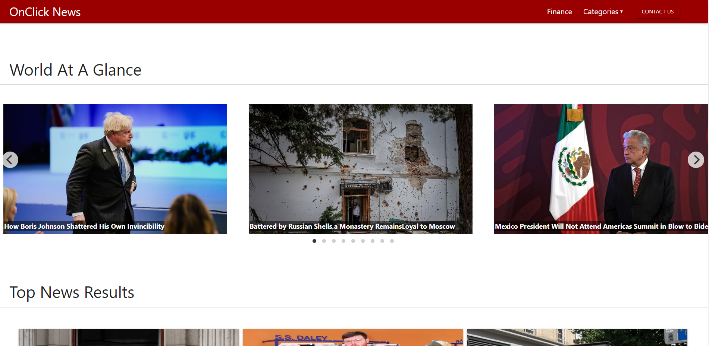
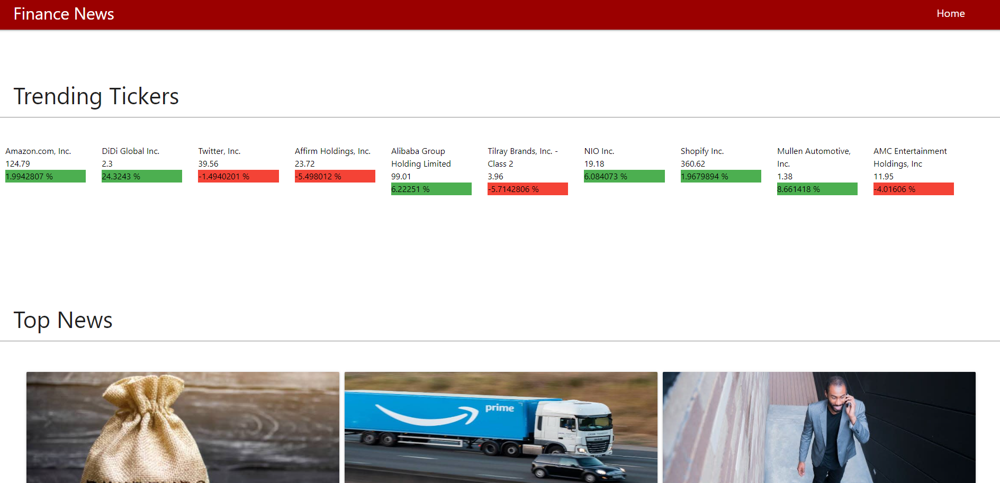

# refactored-succotash-

## First project - Fundamentals

## OnClick News

This is a team project. 

This project was designed to demonstrate the understanding of fundamentals.

This application was designed using HTML, CSS, Javascript, CSS Framework Materialize, Web API, Third Party API's and Server side API's.

## Links:

[GitHub Repository](https://github.com/Pooja3093/refactored-succotash-.git)

[Deployed Application](https://pooja3093.github.io/refactored-succotash-/)

[Full Demo Video](https://drive.google.com/file/d/1QCuLMqh0Kv-UrXfODULK29AW9bpHRUzv/view)

## Summary

In this project we designed a news website that will provide highlights of top stories.

For this purpose, we used two server side API's, one to fetch finance news including stock market data and second to fetch news from other categories.

The main page of this project displays news from categories other than finance. 

The carousel in main page is designed to always display news from "World" category. THe section below it displays top results for selected category.

On first page load, the top results will be shown for Automobile category. For any page load after that it will display the last searched category. This is achieved by storing the last search category in local storage.

Whenever a user clicks a category from the dropdown menu in navbar, the results will be shown in Top Reaults section.

The navbar and footer also contain a Contact Us link. When clicked this link will open a modal containing a form. When the formis submitted, the field values are stored in local storage for future use.

When a user clicks on the Finance option in navbar, the HTML is rediected to another HTML called finance.html.

On the finance page, the top section will display the latest trending tickers. And the section below it will display top news from finance category.

All the news cards in both HTMLs have a reference link to them. Should a user wish to read the complete article, he can just click anywhere on the card and the article will open in a new tab.

## Limitations

Due to limitation of API, the tranding tickers in finance news will not show on weekend and only few can be seen after market close on weekdays. 

Also, both APIs have a drawback that not all news will have Image or URL. In this project we choose to display only the news that has both image and URL. This might result in some empty cards at the end. Due to limited time and understanding of new CSS Framework, we were not able to fix it.

## Future Development

* Search by keyword and/or phrase
* Search by country
* Search for stock market tickers
* Full Page translation 

## Features:

* Modal form for Contact us 
* Click events for finance page, category dropdown and contact form submission
* Color coded rate change on finance ticker(stock data)
* Local storage of last searched category and contact form info
* Fetch calls to New York Times API and YH Finance
* CSS using Materialize framework

## Screenshot:

